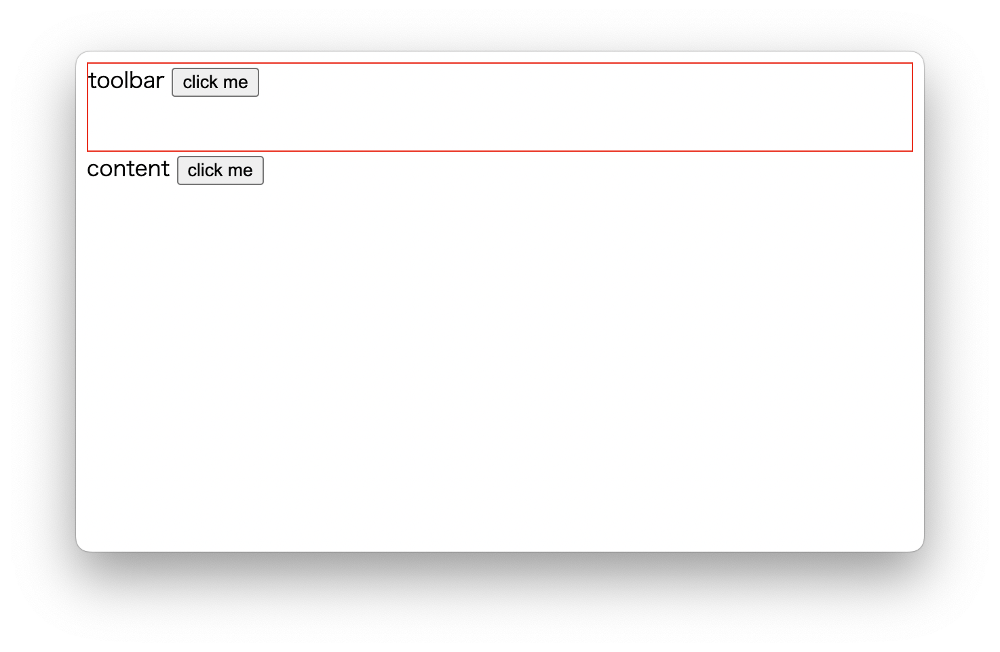

# README
To reproduce an issue for `-webkit-app-region: drag`.

```
$ yarn
...

$ yarn dev
...
```



* (a) The "click me" next "content" can be clicked.
* (b) The "click me" next "toolbar" cannot be clicked.

It's expected (b) can be clicked but doesn't work with electron v23.0.0.
